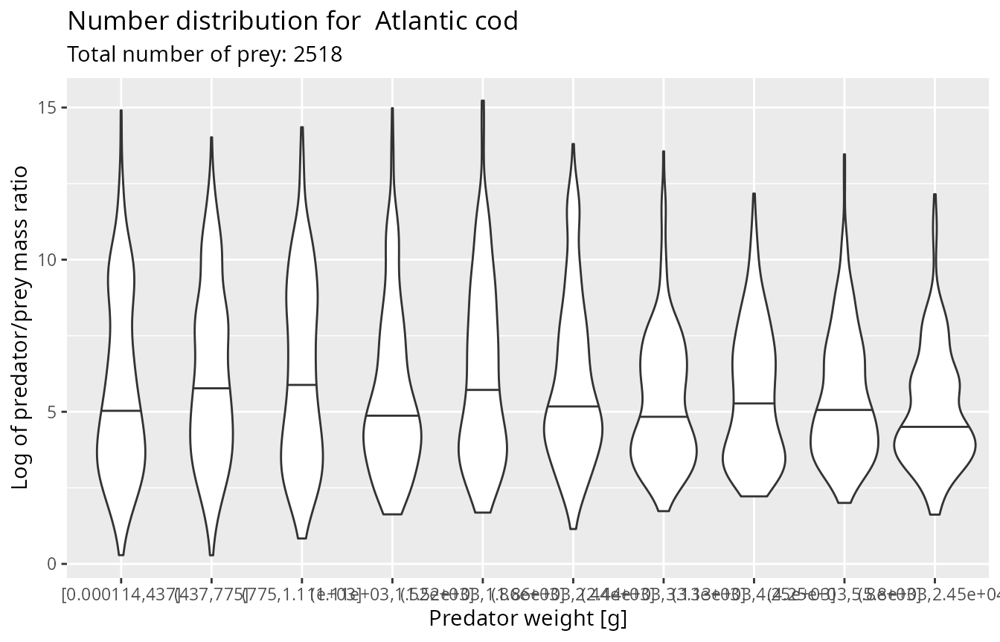
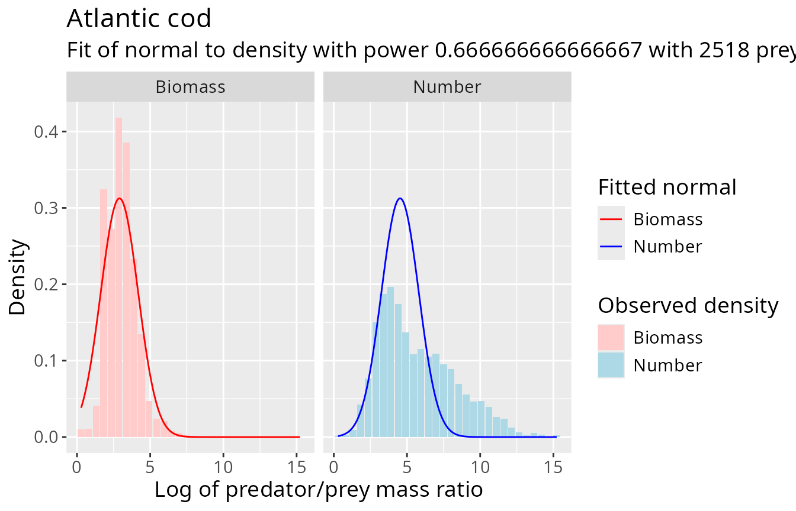
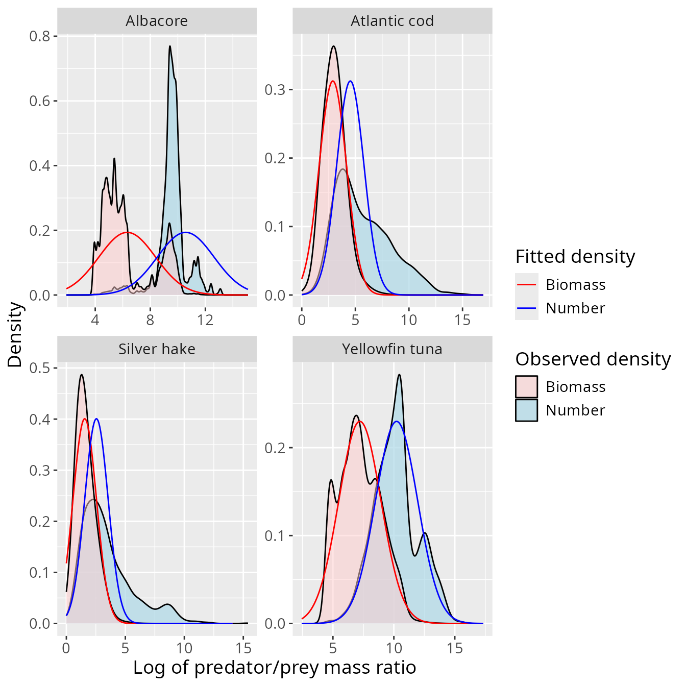
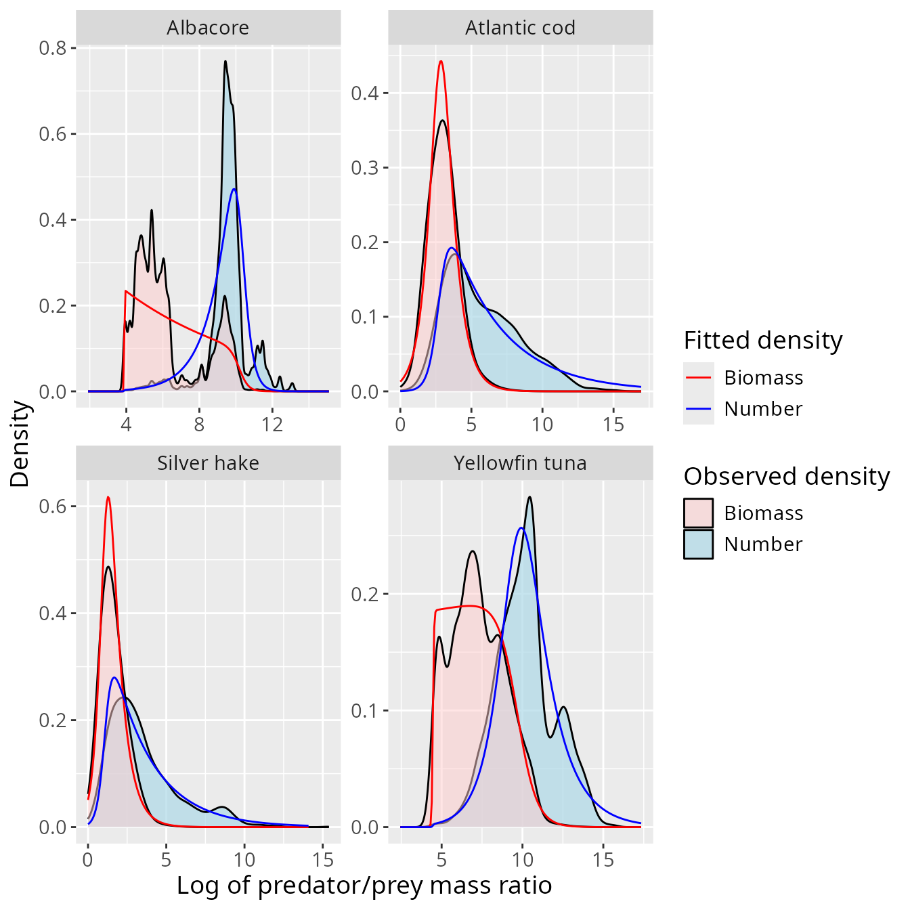

# Choosing and diagnosing a log-PPMR distribution

``` r
library(mizerStomach)
```

This article develops the diagnostic choices introduced in
[`vignette("mizerStomach")`](https://gustavdelius.github.io/mizerStomach/articles/mizerStomach.md).
It uses only `barnes_data`, which is distributed with the package, and
focuses on questions that should be answered before a fit is transferred
to a mizer model:

1.  Is one log predator/prey mass-ratio (log-PPMR) distribution adequate
    across predator sizes?
2.  Which observations should receive most weight?
3.  Does a fitted family describe both the relevant centre and the
    consequential tails?

The mathematical relationship among weighting exponents is derived in
[`vignette("density_functions")`](https://gustavdelius.github.io/mizerStomach/articles/density_functions.md).

## Start with the observations

Each row of `barnes_data` describes one prey item, so `n_prey` is one.
Other datasets can aggregate repeated observations by placing their
count or frequency in `n_prey`.

``` r
head(barnes_data, 4)
#> # A tibble: 4 × 5
#>   species               w_pred w_prey n_prey log_ppmr
#>   <chr>                  <dbl>  <dbl>  <dbl>    <dbl>
#> 1 Atlantic bluefin tuna  61666   3.51      1     9.77
#> 2 Atlantic bluefin tuna  61666   3.51      1     9.77
#> 3 Atlantic bluefin tuna  61666   3.51      1     9.77
#> 4 Atlantic bluefin tuna  61666   4.63      1     9.50
cat(length(unique(barnes_data$species)), "predator species\n")
#> 12 predator species
```

The package deliberately ignores prey identity when fitting PPMR
distributions. Consequently, a species-level fit averages over prey
communities, seasons, locations, cruises, and individual stomachs
represented in the supplied data. Decide whether that aggregation is
defensible before interpreting the result as a stable predator trait.

Common data problems include:

- rounded or imputed predator and prey masses;
- small prey that are missed, highly digested, or identified only to a
  broad taxonomic group;
- rare large prey that are absent from a finite sample;
- unequal sampling effort among predator sizes, places, or seasons; and
- rows from the same stomach or cruise that are not statistically
  independent.

[`validate_ppmr_data()`](https://gustavdelius.github.io/mizerStomach/reference/validate_ppmr_data.md)
checks the package’s data contract, but these scientific issues require
knowledge of the sampling programme.

## Check dependence on predator size

A species-level fit assumes that the conditional log-PPMR distribution
is adequately stable across predator sizes.
[`plot_ppmr_violins()`](https://gustavdelius.github.io/mizerStomach/reference/plot_ppmr_violins.md)
divides the observations into ten predator-mass groups with
approximately equal numbers of rows. The number-weighted view emphasizes
small prey, while `power = 2/3` emphasizes the part of the distribution
relevant to diet biomass under the package’s digestion assumption.

``` r
set.seed(1)
plot_ppmr_violins(barnes_data, "Atlantic cod", power = 0)
#> Warning: `quantiles` for weighted data is not implemented.
#> `quantiles` for weighted data is not implemented.
#> `quantiles` for weighted data is not implemented.
#> `quantiles` for weighted data is not implemented.
#> `quantiles` for weighted data is not implemented.
#> `quantiles` for weighted data is not implemented.
#> `quantiles` for weighted data is not implemented.
#> `quantiles` for weighted data is not implemented.
#> `quantiles` for weighted data is not implemented.
#> `quantiles` for weighted data is not implemented.
```



``` r
set.seed(1)
plot_ppmr_violins(barnes_data, "Atlantic cod", power = 2 / 3)
#> Warning: `quantiles` for weighted data is not implemented.
#> `quantiles` for weighted data is not implemented.
#> `quantiles` for weighted data is not implemented.
#> `quantiles` for weighted data is not implemented.
#> `quantiles` for weighted data is not implemented.
#> `quantiles` for weighted data is not implemented.
#> `quantiles` for weighted data is not implemented.
#> `quantiles` for weighted data is not implemented.
#> `quantiles` for weighted data is not implemented.
#> `quantiles` for weighted data is not implemented.
```


Look for systematic movement of the centre, spread, or shape across
predator groups. If it is substantial, options include:

- fitting a biologically justified predator-size range with
  `min_w_pred`;
- stratifying the data and fitting separate distributions; or
- using a hierarchical model that represents predator size and sampling
  structure explicitly.

The random perturbation used to separate tied predator masses is why the
examples set a seed.

## Choose the fitted weighting

[`fit_log_ppmr()`](https://gustavdelius.github.io/mizerStomach/reference/fit_log_ppmr.md)
weights row $i$ by $n_{prey,i}w_{prey,i}^{q}$, where $q$ is `power`. A
direct fit at `power = 0` emphasizes the numerous small prey in the
right tail of log PPMR. A biomass fit at `power = 1` emphasizes the
rarer large prey in the left tail. Here we use `power = 2/3` to focus on
digestion-adjusted diet biomass.

This choice is part of the estimand. It should not be selected solely
because it makes a particular parametric family look attractive.

## Normal distribution

A normal fit uses the weighted mean and weighted maximum-likelihood
standard deviation. It is easy to interpret, and maps to mizer’s
lognormal feeding kernel, but it is symmetric and has unbounded tails.

``` r
cod_normal <- fit_log_ppmr(
  barnes_data,
  species = "Atlantic cod",
  distribution = "normal",
  power = 2 / 3
)
cod_normal
#>                  mean       sd      species distribution     power min_w_pred
#> Atlantic cod 3.443057 1.276434 Atlantic cod       normal 0.6666667          0
```

``` r
plot_log_ppmr_fit(barnes_data, cod_normal, type = "histogram")
```



The fitted curve is shown at both `power = 0` and `power = 1`. A normal
fit can match the density near the fitted weighting while implying too
much mass in a transformed tail. Negative log PPMR corresponds to prey
heavier than the predator, so a curve placing substantial density there
deserves particular scrutiny.

## Smoothly truncated exponential

The truncated-exponential family has an exponential interior and smooth
logistic cutoffs at both ends. The five parameters control the slope,
cutoff locations, and cutoff steepnesses. They are estimated by weighted
maximum likelihood.

``` r
cod_truncated <- fit_log_ppmr(
  barnes_data,
  species = "Atlantic cod",
  distribution = "trunc_exp",
  power = 2 / 3
)
cod_truncated
#>                   alpha      ll    ul       lr       ur      species
#> Atlantic cod -0.9333927 2.79338 2.777 22.28715 19.99663 Atlantic cod
#>              distribution     power min_w_pred
#> Atlantic cod    trunc_exp 0.6666667          0
```

``` r
plot_log_ppmr_fit(barnes_data, cod_truncated, type = "histogram")
```


This family is useful when an unconstrained normal tail is biologically
implausible or when the observed density has a long approximately
exponential region. It is also a nonlinear five-parameter fit: inspect
its curve, try sensible starting values when necessary, and do not
interpret the smallest and largest observed prey as known physiological
boundaries.

A previous truncated-exponential fit can supply starting values:

``` r
cod_truncated <- fit_log_ppmr(
  barnes_data,
  distribution = "trunc_exp",
  fits = cod_truncated
)
```

## Compare several species

Fits are independent by species even when requested in one call. The
following comparison shows why one family need not be appropriate for
every predator.

``` r
selected_species <- c(
  "Albacore", "Atlantic cod", "Silver hake", "Yellowfin tuna"
)

normal_fits <- fit_log_ppmr(
  barnes_data,
  species = selected_species,
  distribution = "normal",
  power = 2 / 3
)
plot_log_ppmr_fit(barnes_data, normal_fits)
```



``` r
truncated_fits <- fit_log_ppmr(
  barnes_data,
  species = selected_species,
  distribution = "trunc_exp",
  power = 2 / 3
)
plot_log_ppmr_fit(barnes_data, truncated_fits)
```



The plots are diagnostics rather than an automatic model-selection
procedure. The package does not currently return comparable AIC values
or perform a goodness-of-fit test. Prefer the simplest family that
captures the region and tails relevant to the intended model use, and
report the choice and weighting.

## Direct fitting versus transformation

Closed-form transformations describe what a fitted family implies at
another weighting. They do not guarantee that a direct fit to the newly
weighted observations has the same parameters when the family is only
approximate or when predator size affects PPMR.

``` r
cod_number_normal <- fit_log_ppmr(
  barnes_data, "Atlantic cod", "normal", power = 0
)
cod_diet_from_number <- transform_fit(cod_number_normal, power = 2 / 3)

rbind(
  direct_diet_fit = cod_normal[c("power", "mean", "sd")],
  transformed_number_fit =
    cod_diet_from_number[c("power", "mean", "sd")]
)
#>                            power     mean       sd
#> direct_diet_fit        0.6666667 3.443057 1.276434
#> transformed_number_fit 0.6666667 1.217317 2.600442
```

A large difference is useful diagnostic evidence. Fit directly at the
weighting that matters most, and use transformations to examine the
consequences elsewhere.

## Gaussian mixtures

`distribution = "gauss_mix"` can represent multimodality and uses
weighted EM updates from a deterministic initialization. Mixture
likelihoods can have local optima or nearly degenerate components, so
visually inspect the result and consider multiple initializations in a
more specialized analysis.

Gaussian mixtures are supported by
[`get_density()`](https://gustavdelius.github.io/mizerStomach/reference/get_density.md)
and
[`transform_fit()`](https://gustavdelius.github.io/mizerStomach/reference/transform_fit.md)
but cannot currently be transferred to mizer with
[`set_kernel_params()`](https://gustavdelius.github.io/mizerStomach/reference/set_kernel_params.md).
They are therefore most useful for exploratory diagnosis rather than the
final kernel workflow.

## Interactive refinement

[`fit_shiny()`](https://gustavdelius.github.io/mizerStomach/reference/fit_shiny.md)
can switch among families, refit the current species, and adjust
parameters while displaying the number and biomass diagnostics.

``` r
tuned <- fit_shiny(barnes_data, fits = cod_truncated)
```

Manual tuning should be recorded and justified; it is not a replacement
for checking data provenance and sampling structure.

## Reporting and limitations

For a reproducible analysis, report:

- included species and any predator-size threshold;
- mass units and how masses were measured or imputed;
- the weighting exponent;
- the fitted family and parameters;
- plots at both number and biomass weighting; and
- relevant spatial, temporal, cruise, and stomach-level clustering.

If the distribution changes among those strata, a single pooled fit
estimates a mixture of realized diets rather than a universal
preference. Hierarchical or mixed-effects models may then be more
appropriate than any of the package’s simple marginal fits.

After selecting and diagnosing a family, continue with
[`vignette("feeding_kernels")`](https://gustavdelius.github.io/mizerStomach/articles/feeding_kernels.md)
to see how supported fits are transformed into mizer feeding-kernel
parameters. Exact optimizer behavior and return columns are documented
in
[`?fit_log_ppmr`](https://gustavdelius.github.io/mizerStomach/reference/fit_log_ppmr.md),
[`?fit_truncated_exponential`](https://gustavdelius.github.io/mizerStomach/reference/fit_truncated_exponential.md),
and
[`?plot_log_ppmr_fit`](https://gustavdelius.github.io/mizerStomach/reference/plot_log_ppmr_fit.md).
