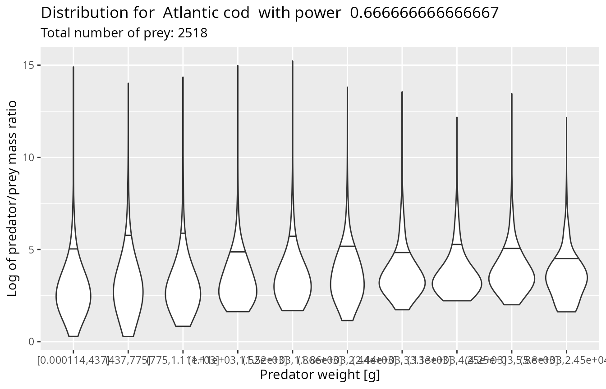
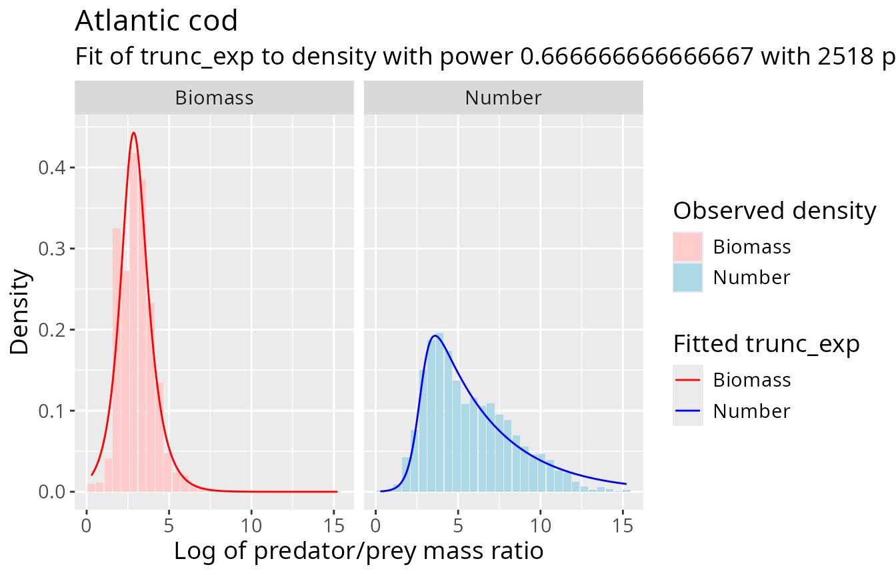

# Getting started

`mizerStomach` uses stomach-content observations to estimate how a
predator’s prey are distributed over body size. It works on the log
predator/prey mass ratio

$$l = \log\left( \frac{w_{pred}}{w_{prey}} \right),$$

fits a probability distribution to $l$, and can translate that
distribution into feeding-kernel parameters for a
[mizer](https://sizespectrum.org/mizer/) model.

This vignette introduces the usual workflow:

1.  prepare and check stomach-content data;
2.  assess whether log PPMR is reasonably independent of predator size;
3.  choose a weighting and fit a distribution;
4.  inspect the fitted number and biomass distributions; and
5.  transfer the fit to a mizer model.

For more depth, read
[`vignette("density_functions")`](https://gustavdelius.github.io/mizerStomach/articles/density_functions.md)
for weighting theory,
[`vignette("PPMR_distributions")`](https://gustavdelius.github.io/mizerStomach/articles/PPMR_distributions.md)
for fit diagnostics, and
[`vignette("feeding_kernels")`](https://gustavdelius.github.io/mizerStomach/articles/feeding_kernels.md)
for the stomach-to-kernel assumptions and derivation.

## Set up

``` r
library(mizerStomach)
```

The package includes `barnes_data`, a set of individual predator/prey
body-mass observations for 12 predator species.

``` r
head(barnes_data, 4)
#> # A tibble: 4 × 5
#>   species               w_pred w_prey n_prey log_ppmr
#>   <chr>                  <dbl>  <dbl>  <dbl>    <dbl>
#> 1 Atlantic bluefin tuna  61666   3.51      1     9.77
#> 2 Atlantic bluefin tuna  61666   3.51      1     9.77
#> 3 Atlantic bluefin tuna  61666   3.51      1     9.77
#> 4 Atlantic bluefin tuna  61666   4.63      1     9.50
```

Your own data can aggregate several identical prey observations in one
row. It must contain these columns:

| Column    | Meaning                                                        |
|:----------|:---------------------------------------------------------------|
| `species` | Predator species name                                          |
| `w_pred`  | Predator body mass                                             |
| `w_prey`  | Body mass of one prey individual, in the same unit as `w_pred` |
| `n_prey`  | Number or frequency of prey represented by the row             |

Predator and prey masses may use any unit as long as they use the *same*
unit. The examples use grams. Prey identity is not used: the fitted
distribution summarizes prey sizes for each predator species.

## Validate the observations

[`validate_ppmr_data()`](https://gustavdelius.github.io/mizerStomach/reference/validate_ppmr_data.md)
checks the required columns and adds `log_ppmr` when it is missing.

``` r
cod_data <- validate_ppmr_data(barnes_data, species = "Atlantic cod")
cod_data <- cod_data[c("species", "w_pred", "w_prey", "n_prey", "log_ppmr")]
head(cod_data, 4)
#> # A tibble: 4 × 5
#>   species      w_pred     w_prey n_prey log_ppmr
#>   <chr>         <dbl>      <dbl>  <dbl>    <dbl>
#> 1 Atlantic cod 0.0154 0.00000270      1     8.65
#> 2 Atlantic cod 0.0508 0.00000639      1     8.98
#> 3 Atlantic cod 0.0940 0.0000138       1     8.83
#> 4 Atlantic cod 0.154  0.0000159       1     9.17
```

If a `log_ppmr` column is already present, the function checks it
against the two mass columns. It warns about disagreement and about prey
that are heavier than their predator. Before fitting, you should also
deal explicitly with non-positive or non-finite masses, missing counts,
and any sampling artifacts specific to your data source. Validation
supplies a consistent format; it does not decide which observations are
biologically credible.

## Check the predator-size assumption

The package fits one marginal log-PPMR distribution per predator
species. This is most useful when that distribution does not change
strongly with predator size.
[`plot_ppmr_violins()`](https://gustavdelius.github.io/mizerStomach/reference/plot_ppmr_violins.md)
divides the selected observations into ten approximately equally
populated predator-mass classes.

``` r
set.seed(1)
plot_ppmr_violins(barnes_data, "Atlantic cod", power = 2 / 3)
#> Warning: `quantiles` for weighted data is not implemented.
#> `quantiles` for weighted data is not implemented.
#> `quantiles` for weighted data is not implemented.
#> `quantiles` for weighted data is not implemented.
#> `quantiles` for weighted data is not implemented.
#> `quantiles` for weighted data is not implemented.
#> `quantiles` for weighted data is not implemented.
#> `quantiles` for weighted data is not implemented.
#> `quantiles` for weighted data is not implemented.
#> `quantiles` for weighted data is not implemented.
```



The small random perturbation used to separate tied predator masses is
why the example sets a seed. A systematic shift in the violin
distributions suggests that a single species-level fit is hiding size
dependence. In that case, consider fitting a restricted predator-size
range with `min_w_pred`, fitting separate groups, or using a model that
represents the dependence directly.

Other assumptions also matter. The stomach sample should represent the
place, season, and predator population for which the kernel will be
used, and the smallest and largest prey can be especially sensitive to
identification and sampling limits.

## Weight the prey observations

For
[`fit_log_ppmr()`](https://gustavdelius.github.io/mizerStomach/reference/fit_log_ppmr.md),
row $i$ receives weight

$$n_{prey,i}\, w_{prey,i}^{q},$$

where $q$ is the `power` argument. Useful choices include:

| `power`        | Distribution emphasized                                                              |
|:---------------|:-------------------------------------------------------------------------------------|
| `0`            | Number of prey individuals in stomachs                                               |
| `2/3`          | Diet biomass under the package’s surface-area scaling assumption for digestion       |
| `1`            | Prey biomass in stomachs                                                             |
| `lambda - 4/3` | Feeding-kernel representation used for a mizer model with resource exponent `lambda` |

The best choice depends on the question and on which part of the
observed distribution is reliable. Large numbers of tiny prey can
dominate a number fit while contributing little biomass. Conversely, a
few large prey can dominate a biomass fit.

A fit stores its exponent in the `power` column.
[`transform_fit()`](https://gustavdelius.github.io/mizerStomach/reference/transform_fit.md)
can analytically express each supported fitted family at another
exponent. It does this by multiplying the fitted density by the
appropriate exponential function of log PPMR and renormalizing; it does
*not* return to the observations. A direct fit at the target power can
therefore differ when the chosen family is only an approximation to the
data, or when PPMR depends on predator size.

## Fit a distribution

We start with a normal distribution at `power = 2/3`.

``` r
cod_normal <- fit_log_ppmr(
  barnes_data,
  species = "Atlantic cod",
  distribution = "normal",
  power = 2 / 3
)
cod_normal
#>                  mean       sd      species distribution     power min_w_pred
#> Atlantic cod 3.443057 1.276434 Atlantic cod       normal 0.6666667          0
```

For the normal family, the estimate is particularly transparent: `mean`
is the weighted mean of `log_ppmr`, and `sd` is the weighted
maximum-likelihood standard deviation. The weights are the expression
above, and multiplying all of them by a common constant leaves the fit
unchanged.

The normal distribution is convenient but is symmetric and has no
explicit lower or upper prey-size boundary. A smoothly truncated
exponential is often a more flexible description of a feeding range.

``` r
cod_truncated <- fit_log_ppmr(
  barnes_data,
  species = "Atlantic cod",
  distribution = "trunc_exp",
  power = 2 / 3
)
cod_truncated
#>                   alpha      ll    ul       lr       ur      species
#> Atlantic cod -0.9333927 2.79338 2.777 22.28715 19.99663 Atlantic cod
#>              distribution     power min_w_pred
#> Atlantic cod    trunc_exp 0.6666667          0
```

This fit minimizes a weighted negative log-likelihood. `alpha` controls
the exponential slope, `ll` and `lr` locate the left and right logistic
cutoffs, and `ul` and `ur` control how sharp those cutoffs are. It is a
nonlinear five-parameter optimization, so a fit should always be checked
visually. A previous fit can be supplied through `fits` to reuse its
parameters as starting values:

``` r
cod_truncated <- fit_log_ppmr(
  barnes_data,
  distribution = "trunc_exp",
  fits = cod_truncated
)
```

The third family, `distribution = "gauss_mix"`, fits a two-component
normal mixture with weighted EM updates. It can represent multimodality
but is not currently supported by
[`set_kernel_params()`](https://gustavdelius.github.io/mizerStomach/reference/set_kernel_params.md).
Mixture fits can be sensitive to initialization and nearly degenerate
components, so use them for exploratory diagnosis and check the result
carefully.

## Diagnose a fit

[`plot_log_ppmr_fit()`](https://gustavdelius.github.io/mizerStomach/reference/plot_log_ppmr_fit.md)
shows both views of the same fit. Blue compares the observed and fitted
number distributions (`power = 0`); red compares the observed and fitted
biomass distributions (`power = 1`). The stored fit is transformed to
both powers automatically.

``` r
plot_log_ppmr_fit(barnes_data, cod_normal, type = "histogram")
```


``` r
plot_log_ppmr_fit(barnes_data, cod_truncated, type = "histogram")
```



The empirical curves or bars are descriptive diagnostics, not formal
goodness-of-fit tests. Look especially at the tails: the number
distribution contains most information about small prey (large PPMR),
whereas the biomass distribution highlights large prey (small PPMR). A
family that looks adequate at the fitted power can still extrapolate
poorly when transformed to another power.

Use
[`get_density()`](https://gustavdelius.github.io/mizerStomach/reference/get_density.md)
when numerical density values are more useful than a plot.

``` r
log_ppmr_grid <- seq(2, 12, length.out = 6)
data.frame(
  log_ppmr = log_ppmr_grid,
  density = get_density(log_ppmr_grid, cod_truncated)
)
#>   log_ppmr      density
#> 1        2 0.1608592318
#> 2        4 0.2415961441
#> 3        6 0.0386598929
#> 4        8 0.0059783967
#> 5       10 0.0009243795
#> 6       12 0.0001429275
```

Multiple species can be fitted in one call. They are fitted
independently and returned as one row per species.

``` r
tuna_fits <- fit_log_ppmr(
  barnes_data,
  species = c("Albacore", "Yellowfin tuna"),
  distribution = "normal",
  power = 2 / 3
)
tuna_fits
#>                    mean       sd        species distribution     power
#> Albacore       7.738940 2.060902       Albacore       normal 0.6666667
#> Yellowfin tuna 8.215865 1.735238 Yellowfin tuna       normal 0.6666667
#>                min_w_pred
#> Albacore                0
#> Yellowfin tuna          0
```

For interactive tuning,
[`fit_shiny()`](https://gustavdelius.github.io/mizerStomach/reference/fit_shiny.md)
provides parameter sliders, automatic refitting, undo/reset controls,
and the same diagnostic plot. It opens a browser and blocks the R
session, so this example is not run while building the vignette.

``` r
tuned_fit <- fit_shiny(barnes_data, fits = cod_truncated)
```

## Put a fit into a mizer model

[`set_kernel_params()`](https://gustavdelius.github.io/mizerStomach/reference/set_kernel_params.md)
supports normal and truncated-exponential fits. It first transforms the
fit from its recorded `power` to the exponent required by the model,

$$q_{mizer} = \lambda - \frac{4}{3},$$

where `lambda` is the resource-spectrum exponent in the `MizerParams`
object. It then maps a normal distribution to mizer’s `"lognormal"`
feeding kernel, or a truncated exponential to its `"power_law"` kernel.

Species names in the fit and model must agree. The Barnes data call the
species `"Atlantic cod"`, while
[`mizer::NS_params`](https://sizespectrum.org/mizer/reference/NS_params.html)
calls it `"Cod"`, so we rename the fit row before transferring it.

``` r
params <- mizer::NS_params

model_cod_fit <- cod_normal
model_cod_fit$species <- "Cod"
rownames(model_cod_fit) <- "Cod"

params <- set_kernel_params(params, model_cod_fit)
subset(
  mizer::species_params(params),
  species == "Cod",
  select = c(species, pred_kernel_type, beta, sigma)
)
#> An object of class "species_params" containing parameters for 1 species:
#>  species pred_kernel_type     beta    sigma
#>      Cod        lognormal 25.17419 1.276434
```

Only species represented in the fit are changed. Assign the return
value, as above, because the input `params` object is not modified in
place.

[`extract_fit()`](https://gustavdelius.github.io/mizerStomach/reference/extract_fit.md)
performs the reverse conversion. It is useful for inspecting existing
kernels with the same plotting and transformation tools, or as the
starting point for manual changes.

``` r
extracted <- extract_fit(params)
extracted["Cod", c("species", "distribution", "power", "mean", "sd")]
#>     species distribution power     mean       sd
#> Cod     Cod       normal     0 4.529247 1.276434
```

The extracted distributions are returned at `power = 0`, so they
describe the number-weighted log-PPMR representation implied by the
current model kernels.

## Where to go next

The other vignettes develop the assumptions behind this workflow:

- [`vignette("density_functions", package = "mizerStomach")`](https://gustavdelius.github.io/mizerStomach/articles/density_functions.md)
  derives the relationships among number, stomach biomass, diet biomass,
  and other log-PPMR weightings.
- [`vignette("PPMR_distributions", package = "mizerStomach")`](https://gustavdelius.github.io/mizerStomach/articles/PPMR_distributions.md)
  discusses data limitations, predator-size dependence, family choice,
  and fit diagnostics.
- [`vignette("feeding_kernels", package = "mizerStomach")`](https://gustavdelius.github.io/mizerStomach/articles/feeding_kernels.md)
  derives the transformation from a stomach distribution to a mizer
  feeding kernel and explains its assumptions.

The practical rule is simple: validate the measurements, inspect the
predator-size dependence, fit at a weighting relevant to the biological
question, and judge both the number and biomass implications before
updating a model.
