# Prey size selectivity

## Introduction

We want to use stomach data to estimate values for the prey size
selectivity in mizer models. In these notes we will first discuss the
stomach data and then the mizer model before discussing the estimation
task.

## Stomach data

Stomach data is collected by taking samples of fish from the sea (the
predators) and for each fish measuring their size (length or weight)
before slicing open their stomach and recording the size of all the prey
items found therein. The resulting data sets usually contain information
about the time and location where the sample was taken and the species
of the predator and the species of each prey item. However sometimes
instead of species identity only the functional group is recorded,
especially for prey items.

In these notes, for the purpose of estimating the size selectivity of
the predators for their prey, we will ignore the species identity of the
prey and concentrate on the species identity and size of the predator
and the size of the prey. We will assume that the size information is
given as weight, possibly converted from length to weight by an
allometric length-weight relationship. We will denote the predator
species as $`s`$, the predator weight as $`w`$ and the prey weight as
$`w_p`$.

For illustrating the ideas in these notes, we will work with two stomach
data sets. One is ICES data that was compiled for us by Murray, and here
we will concentrate in particular on Cod as the predator for
illustration, and the other is a data set compiled by Mariella Canales
containing data about Sardine and Anchovy stomachs collected in Chile.

``` r
# Load dataset compiled by Murray, then keep only ICES data because the
# prey sizes of the DAPSTOM data are not reliable.
load("../../stomach_data/data/stomach_dataset.Rdata")
stom_df <- filter(stom_df, data == "ICES_YOTS")
# We will be concentrating on Cod as the predator species and we don't need
# all variables
murray <- stom_df |>
    filter(!is.na(pred_weight_g),
           prey_ind_weight_g > 0,
           prey_count > 0) |>
    select(pred_species, pred_weight_g, prey_ind_weight_g, prey_count) |>
    group_by(pred_species) |> 
    filter(n() > 1000) |> 
    rename(w_prey = prey_ind_weight_g, w_pred = pred_weight_g, n_prey = prey_count) |>
    mutate(log_ppmr = log(w_pred / w_prey),
           weight_numbers = n_prey / sum(n_prey))

cod <- murray |>
    filter(pred_species == "Gadus morhua")

# Load Mariella's data set
library(readr)
anchovy <- read_csv("../../stomach_data/data/AnchovyAndSardine.csv", show_col_types = FALSE) |>
    filter(Species == "anchovy") |>
    transmute(w_pred = wpredator,
              w_prey = wprey,
              n_prey = Nprey,
              log_ppmr = log(wpredator / wprey))
```

### Log predator/prey mass ratio

It is useful to work with the log of the ratio of predator weight
divided by prey weight, instead of with the prey weight. So we introduce
a new variable $`l = \log(w/w_p).`$ Here is a scatterplot of this
variable for all observations from the ICES database where the predator
is cod, together with a red line representing the smoothed mean of the
variable.

``` r
stomach <- cod
ggplot(stomach, aes(x = log(w_pred), y = log_ppmr)) +
    geom_point() +
    geom_smooth(aes(weight = n_prey), colour = "red") +
    xlab("Log of predator mass [g]") +
    ylab("Log of predator/prey mass ratio")
```

    ## `geom_smooth()` using method = 'gam' and formula = 'y ~ s(x, bs = "cs")'

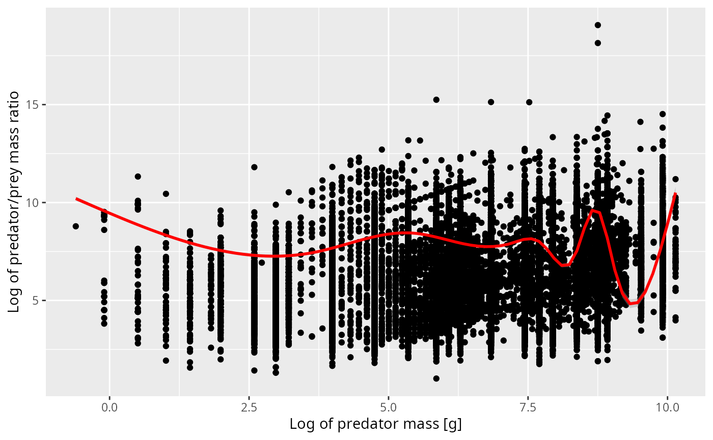

We see that for predators, often only a very much rounded value has been
recorded, which leads to the vertical stripes. There are also a few
suspicious observations which form diagonal stripes with a slope of 1.
These arise if the prey weight is rounded, probably by taking a typical
weight for the prey species rather than measuring the actual prey
individual.

The curve representing the smoothed mean does not go through the centre
of that scatterplot at all. That happens because there is a lot of
overplotting. Therefore in the next figure we have binned the data in
both the x and y direction and use colour to indicate the number of
observations in each bin. Note the logarithmic scale on the count
colours. Yellow bins have huge numbers of observations in them.

``` r
ggplot(stomach, aes(x = log(w_pred), y = log_ppmr)) +
    stat_summary_2d(aes(z = n_prey), fun = "sum", bins = 60) + 
    scale_fill_viridis_c(trans = "log") +
    geom_smooth(aes(weight = n_prey), colour = "red") +
    xlab("Log of predator mass [g]") +
    ylab("Log of predator/prey mass ratio")
```

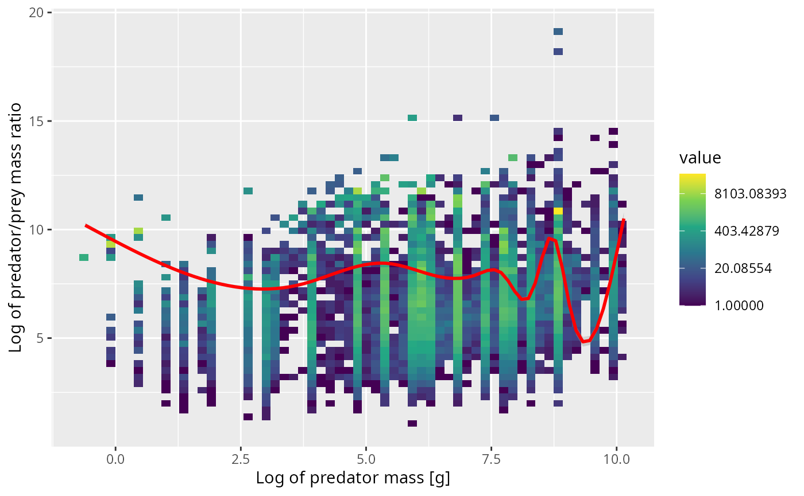

The next plot shows the same in a different way. We now work with 10
predator size classes (chosen so that each has similar number of
observations in it) and for each size class show the distribution of the
log of the predator/prey mass ratio as a violin plot.

``` r
stomach_binned <- stomach |> 
    # bin data
    mutate(bin = cut_number(w_pred * 
                                # We need to wiggle the data a bit to avoid
                                # duplicates which `cut_number()` does not like
                                rnorm(length(w_pred), 1, 0.001), 
                            10))

ggplot(stomach_binned, aes(bin, log_ppmr)) +
    geom_violin(aes(weight = n_prey),
                draw_quantiles = 0.5) +
    xlab("Predator weight [g]") +
    ylab("Log of predator/prey mass ratio")
```

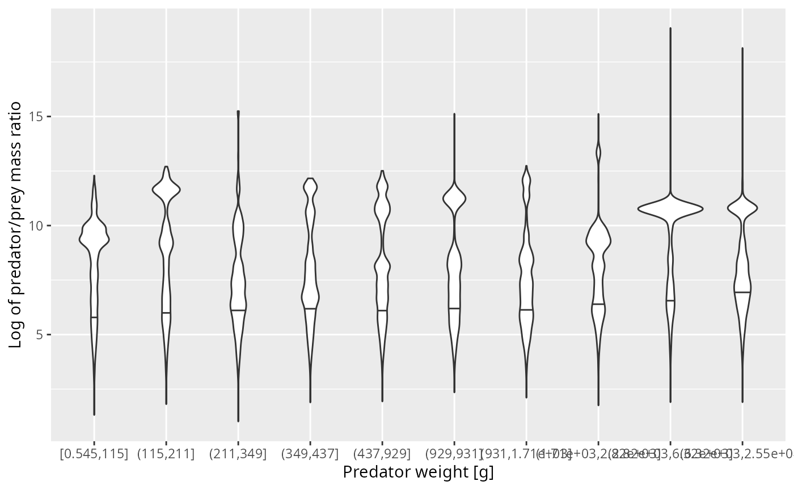

I think there is clear evidence of observational artefacts that are due
to the fact that the small prey was not measured very well. If we were
to average the predator/prey mass ratio over these observations, we
would get too small a value due to the missing observations of the small
prey.

### Diet ppmr distribution

Luckily, the small prey also don’t contribute much biomass to the
predator’s diet. When we are interested in the mean predator/prey mass
ratio we should look at a weighted mean, where each observation is
weighted by its contribution to the diet.

To get the diet from the stomach observations we need to make an
assumption about the rate of digestion. It seems reasonable to make the
approximation that the rate at which a prey item has its body mass
digested away scales with body mass $`w_p`$ as $`w_p^{2/3}`$ because
digestion acts on the surface of the prey item and this surface scales
approximately as $`w_p^{2/3}`$. Thus in order to weight each prey item
according to its contribution to the predator’s diet we need to weight
it by a factor of $`w_p^{2/3}`$.

``` r
# Set digestion exponent
dig <- 2/3
```

This weighting produces the following plot, where now the red line
represents the smoothed weighted mean.

``` r
ggplot(cod, aes(x = log(w_pred), y = log_ppmr)) +
    stat_summary_2d(aes(z = n_prey * w_prey^dig), fun = "sum", bins = 60) + 
    scale_fill_viridis_c(trans = "log") +
    geom_smooth(aes(weight = n_prey * w_prey^dig), colour = "red") +
    xlab("Log of predator mass [g]") +
    ylab("Log of predator/prey mass ratio")
```

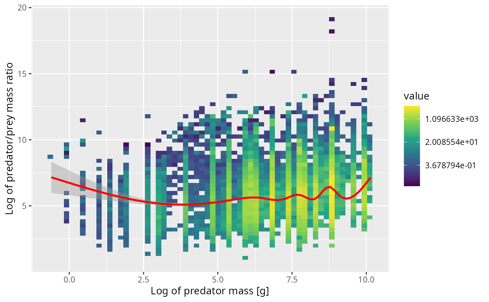

The violin plot now shows how the diet is distributed over the log ppmr
for different predator size classes. These distributions look much more
normal and also seem to not depend much on the predator size class.

``` r
ggplot(stomach_binned, aes(bin, log_ppmr)) +
    geom_violin(aes(weight = n_prey * w_prey^dig),
                draw_quantiles = 0.5) +
    xlab("Predator weight [g]") +
    ylab("Log of predator/prey mass ratio")
```

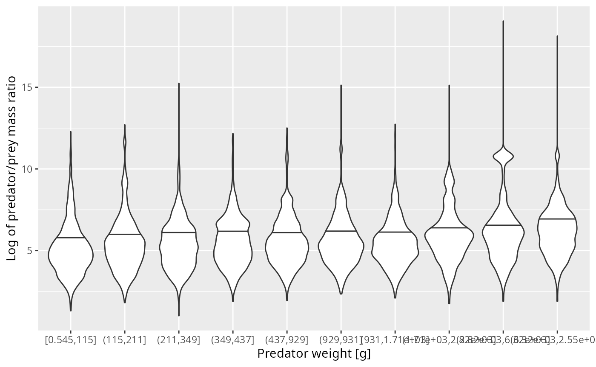

### Normal distribution works for cod

Given that the distributions don’t depend strongly on the predator size
class, let’s aggregate them into a single distribution and fit a normal
distribution.

``` r
weighted.sd <- function(x, w) {
  sqrt(sum(w * (x - weighted.mean(x, w))^2))
}
weight <- stomach$n_prey * (stomach$w_prey / stomach$w_pred)^dig
weight <- weight / sum(weight)

est_mean <- weighted.mean(stomach$log_ppmr, weight)
est_sd <- weighted.sd(stomach$log_ppmr, weight)

ggplot(stomach |> filter(log_ppmr < 12)) +
    geom_density(aes(log_ppmr, 
                     weight = n_prey * (w_prey / w_pred)^dig),
                 bw = 0.2) +
    stat_function(fun = dnorm, 
                  args = list(mean = est_mean, 
                              sd = est_sd), 
                  colour = "blue") +
    xlab("Log of Predator/Prey mass ratio") +
    ylab("Normalised diet density")
```

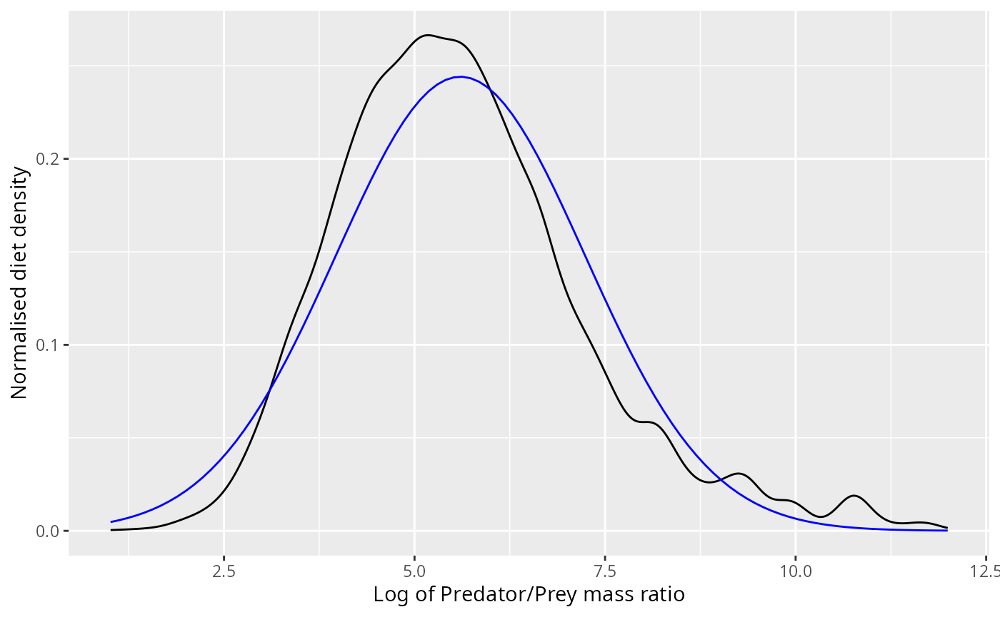

The normal distribution appears to fit the observations pretty well,
even though it does not capture the skewness correctly.

Due to the nature of the normal distribution, if the diet is normally
distributed with some mean $`\mu`$ and variance $`\sigma^2`$, then also
the number of prey is normally distributed with the same variance but
with a shifted mean of $`\mu + 2/3 \sigma^2`$. The next plot shows this
normal density superimposed on the observed number density.

``` r
ggplot(stomach) +
    geom_density(aes(log_ppmr, weight = n_prey), bw = 0.2) +
    stat_function(fun = dnorm, 
                  args = list(mean = est_mean + dig * est_sd^2, 
                              sd = est_sd), 
                  colour = "blue") +
    xlab("Log of Predator/Prey mass ratio") +
    ylab("Normalised number density")
```

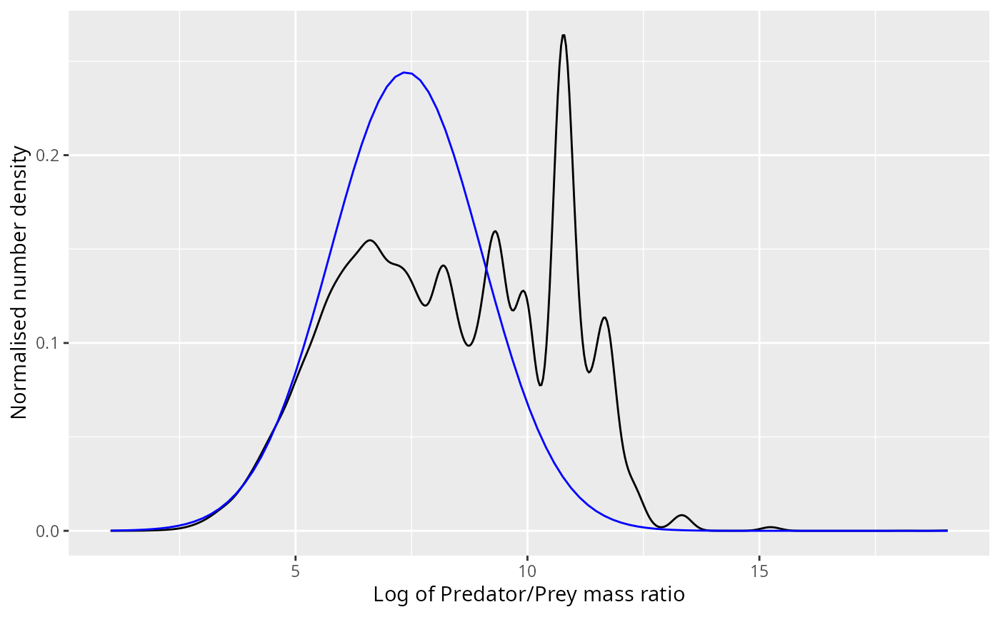

The bump at a log ppmr of around 11 that the normal distribution does
not capture no longer looks so small. However, if we neglect the
predation of these smaller prey items that will only have a negligible
effect on the mizer model because of two lucky facts:

1.  As we already discussed, for the growth of the predator only the
    biomass in its diet is relevant, and that biomass is not changed
    much if we neglect those small prey items.

2.  If we neglect to model the predation on those small prey items, we
    are reducing the mortality imposed on the population of those small
    prey, but because small prey are so much more abundant, this
    increase in total mortality has a negligible effect on the
    per-capita mortality.

### Fitting using both means

An alternative way to fit the normal distribution would be to choose it
so that the means of both the number distribution and the diet
distribution match the corresponding sample means. This means that the
standard deviation of the normal distribution is chosen so that

``` r
est_mean_num <- weighted.mean(stomach$log_ppmr, stomach$n_prey)
est_sd_alt <- sqrt((est_mean_num - est_mean) / dig)
```

``` r
ggplot(stomach |> filter(log_ppmr < 12)) +
    geom_density(aes(log_ppmr, 
                     weight = n_prey * (w_prey / w_pred)^dig),
                 bw = 0.2) +
    stat_function(fun = dnorm, 
                  args = list(mean = est_mean, 
                              sd = est_sd_alt), 
                  colour = "blue") +
    xlab("Log of Predator/Prey mass ratio") +
    ylab("Normalised diet density")
```

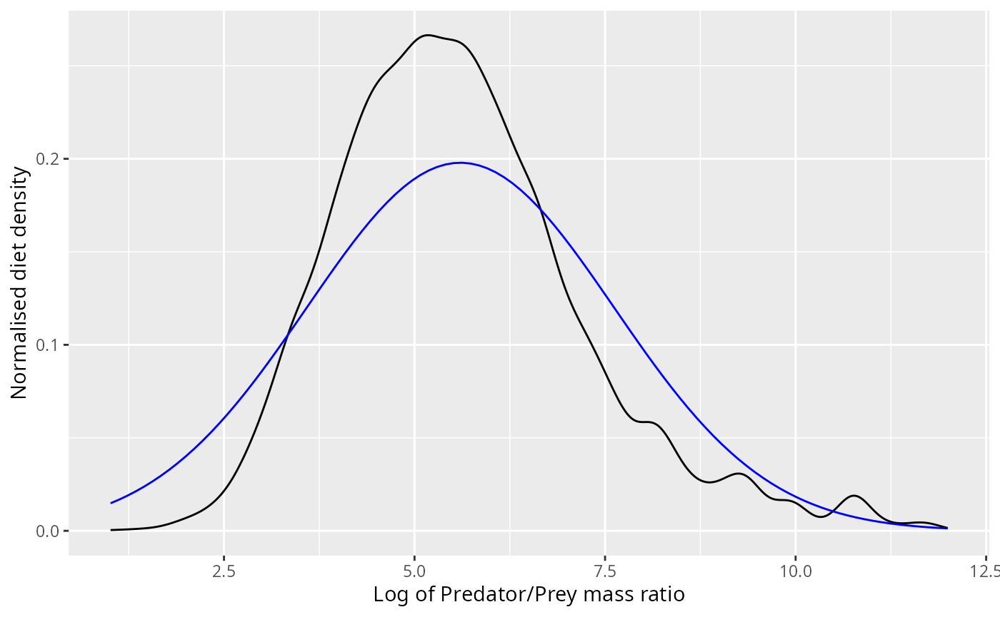

``` r
ggplot(stomach) +
    geom_density(aes(log_ppmr, weight = n_prey), bw = 0.2) +
    stat_function(fun = dnorm, 
                  args = list(mean = est_mean_num, 
                              sd = est_sd_alt), 
                  colour = "blue") +
    xlab("Log of Predator/Prey mass ratio") +
    ylab("Normalised number density")
```

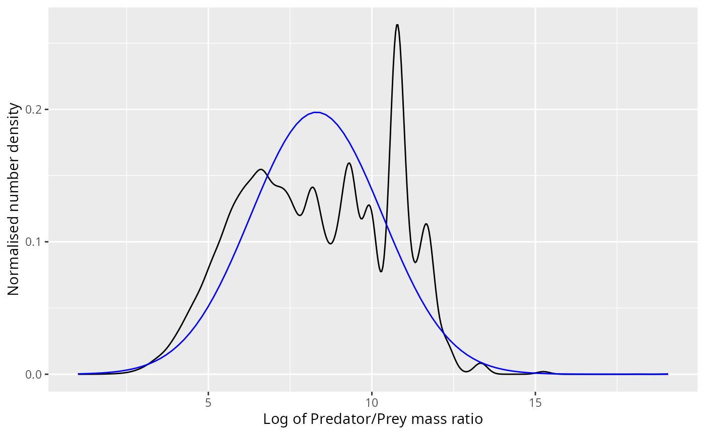

### Other predator species

We can fit normal distributions to the diet of other predator species:

``` r
stomach <- murray
grid <- seq(0, max(stomach$log_ppmr), length = 100)
normaldens <- plyr::ddply(stomach, "pred_species", function(stomach) {
    weight <- stomach$n_prey * (stomach$w_prey / stomach$w_pred)^dig
    weight <- weight / sum(weight)

    est_mean <- weighted.mean(stomach$log_ppmr, weight)
    est_sd <- weighted.sd(stomach$log_ppmr, weight)
    data.frame( 
        log_ppmr = grid,
        density = dnorm(grid, est_mean, est_sd)
        )
})

stomach <- stomach |>
    mutate(weight_diet = (n_prey * (w_prey / w_pred)^dig) / 
               sum(n_prey * (w_prey / w_pred)^dig))

ggplot(stomach) +
    geom_density(aes(log_ppmr, weight = weight_diet),
                 fill = "#00BFC4", bw = 0.5) +
    facet_wrap(~pred_species, scales = "free_y", ncol = 4) +
    xlab("Log of predator/prey mass ratio")  +
    ylab("Diet density") +
    geom_line(aes(log_ppmr, density), data = normaldens,
                  colour = "red")
```

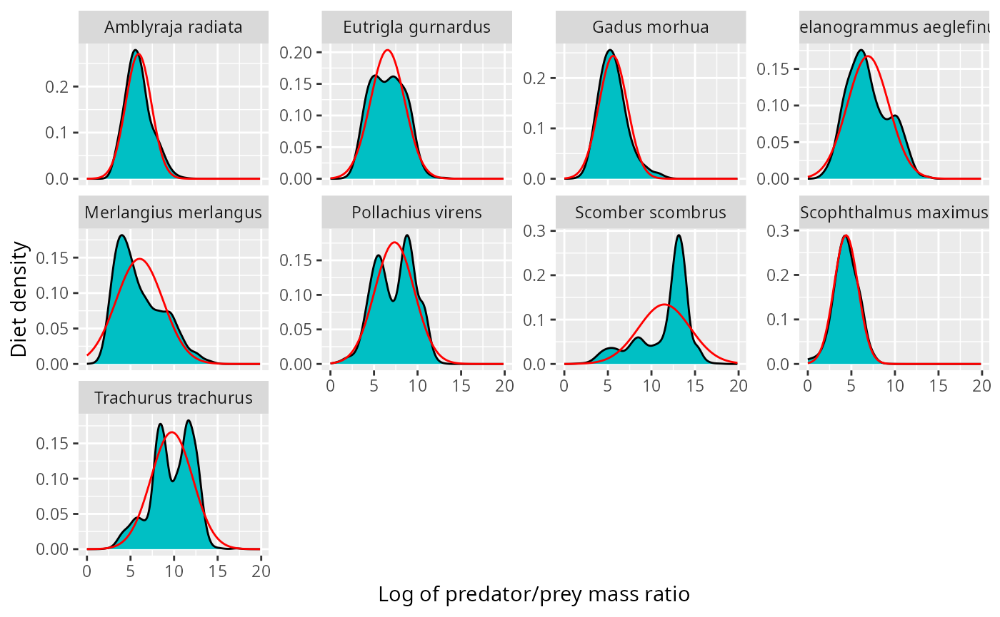

The fit does not look very good for the mackerel (scomber scombrus).
This problem becomes more pronounced when we look at the corresponding
number distributions.

``` r
stomach <- murray
shifted_normaldens <- plyr::ddply(stomach, "pred_species", function(stomach) {
    weight <- stomach$n_prey * (stomach$w_prey / stomach$w_pred)^dig
    weight <- weight / sum(weight)

    est_mean <- weighted.mean(stomach$log_ppmr, weight)
    est_sd <- weighted.sd(stomach$log_ppmr, weight)
    data.frame( 
        log_ppmr = grid,
        density = dnorm(grid, est_mean + dig * est_sd^2, est_sd)
        )
})

ggplot(stomach) +
    geom_density(aes(log_ppmr, weight = weight_numbers),
                 fill = "#00BFC4", bw = 0.5) +
    facet_wrap(~pred_species, scales = "free_y", ncol = 4) +
    xlab("Log of predator/prey mass ratio")  +
    ylab("Number density") +
    geom_line(aes(log_ppmr, density), data = shifted_normaldens,
                  colour = "blue")
```

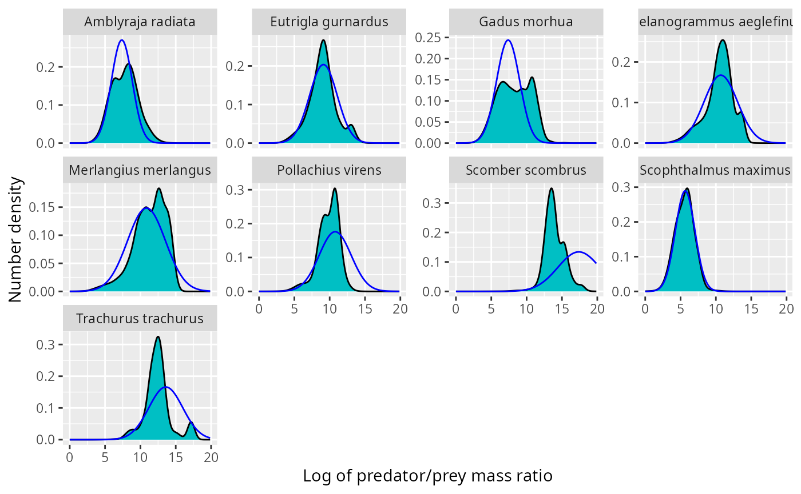 For
pollock, mackerel and horse mackerel, the normal distribution is shifted
to far to the right. There are various ways to fix this:

1.  Reduce the variance of the normal distribution, so that the normal
    number distribution is shifted less compared to the normal diet
    distribution.

2.  Use the truncated exponential distribution instead of the normal
    distribution.

3.  Fit a mixed effects model to the diet data, taking into account
    location, time, predator individual and possibly more. This will
    leave less residual variance and hence lead to less of a shift when
    going from diet distribution to number distribution.

We can visualise the same data also with histograms instead of kernel
density estimates:

``` r
no_bins <- 30  # Number of bins
binsize <- (max(stomach$log_ppmr) - min(stomach$log_ppmr)) / (no_bins - 1)
breaks <- seq(min(stomach$log_ppmr) - binsize/2,
              by = binsize, length.out = no_bins + 1)

binned_stomach <- stomach |> 
    # bin data
    mutate(bin = cut(log_ppmr, breaks = breaks, right = FALSE,
                     labels = FALSE)) |> 
    group_by(pred_species, bin) |> 
    summarise(Numbers = sum(n_prey), 
             Diet = sum(n_prey * (w_prey / w_pred)^dig)) |> 
    # normalise
    mutate(Numbers = Numbers / sum(Numbers) / binsize,
           Diet = Diet / sum(Diet) / binsize)  |>
    # column for predator/prey size ratio
    mutate(log_ppmr = breaks[bin] + binsize/2) |>
    tidyr::gather(key = "Type", value = "Density", Numbers, Diet)
```

``` r
normaldens <- plyr::ddply(stomach, "pred_species", function(stomach) {
    weight <- stomach$n_prey * (stomach$w_prey / stomach$w_pred)^dig
    weight <- weight / sum(weight)

    est_mean <- weighted.mean(stomach$log_ppmr, weight)
    est_sd <- weighted.sd(stomach$log_ppmr, weight)
    data.frame( 
        log_ppmr = grid,
        Diet = dnorm(grid, est_mean, est_sd),
        Numbers = dnorm(grid, est_mean + dig * est_sd^2, est_sd)
        )
    }) |>
    tidyr::gather(Type, Density, Numbers, Diet)

ggplot(binned_stomach) +
  geom_col(aes(log_ppmr, Density, fill = Type)) +
  facet_grid(pred_species ~ Type, scales = "free_y") +
    xlab("Log of predator/prey mass ratio") +
    geom_line(aes(log_ppmr, Density, colour = Type), data = normaldens)
```

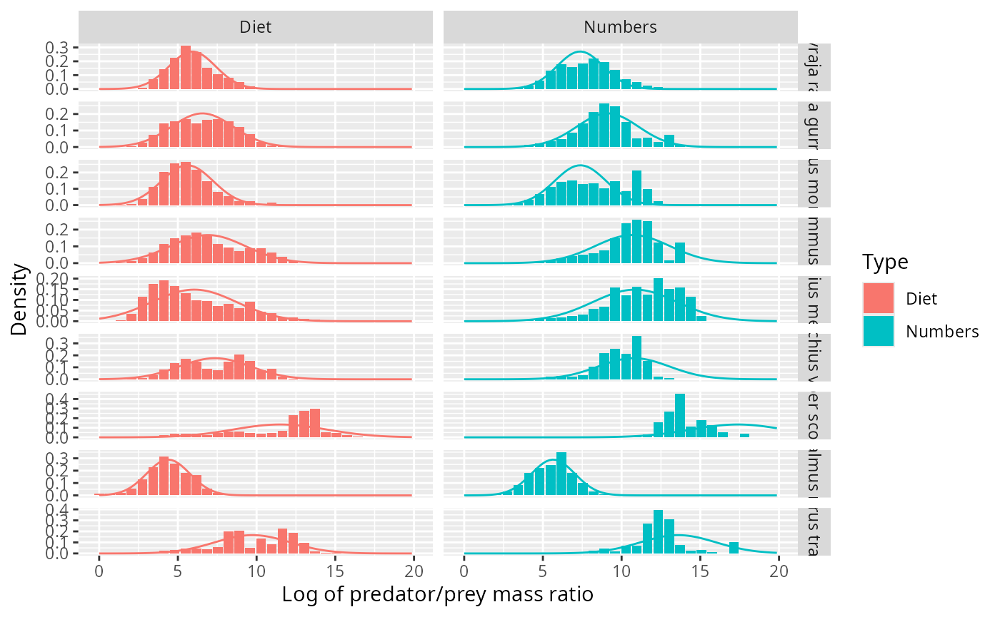
